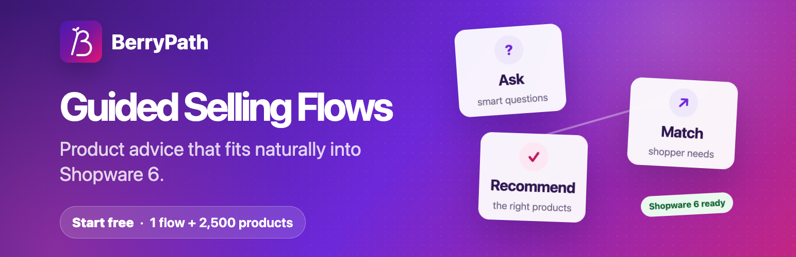
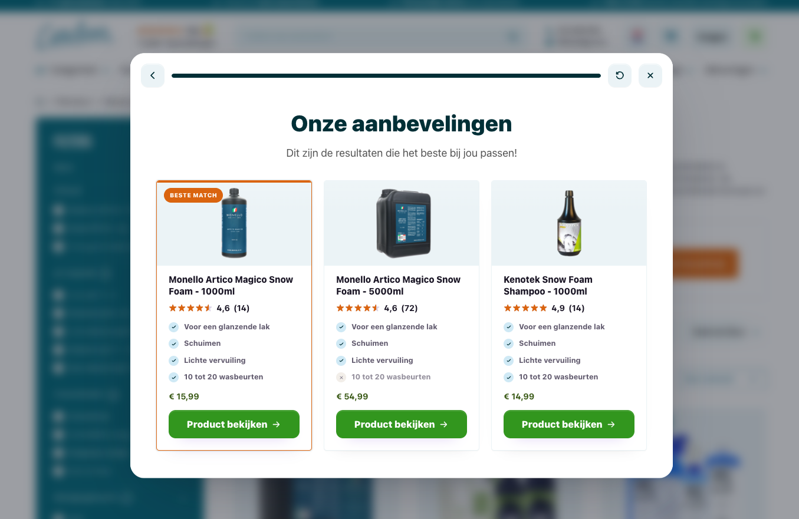
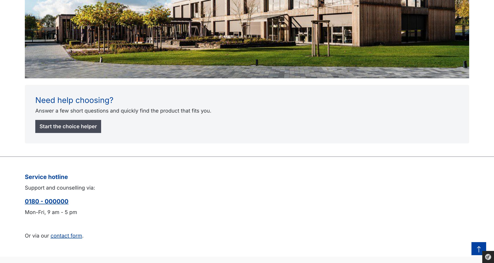
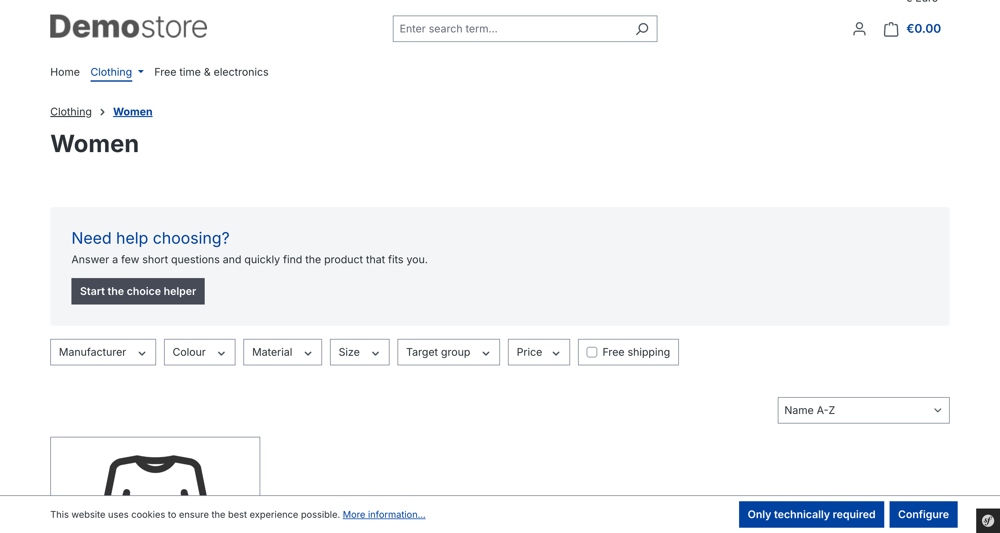
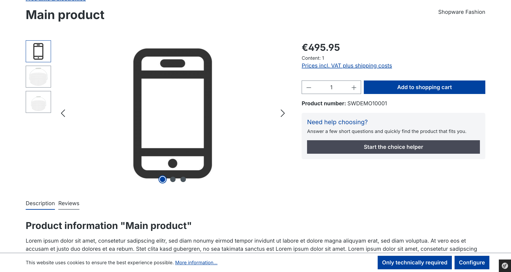

# BerryPath Guided Selling Flows for Shopware 6



Help shoppers choose the right product with guided selling flows in Shopware 6 Shopping Experiences and product detail pages.

New to BerryPath? A free plan is available with **1 guided selling flow and up to 2,500 products**. Existing customers keep using their current plan.

- [Start for free](https://app.berrypath.eu/register)
- [Shopware setup guide](https://www.berrypath.eu/docs/shopware-plugin)
- [Shopware product advice](https://www.berrypath.eu/shopware-product-advice)
- [Live demo](https://www.berrypath.eu/demo/category)

## Guide shoppers where decisions happen

- **Shopping Experiences:** add guided product advice to homepages, landing pages, category layouts, and campaigns.
- **Product pages:** help shoppers confirm whether the current product fits before they buy.
- **Popup, sidebar, or inline:** choose the experience that best fits the page and storefront theme.
- **Responsive storefront:** keep the choice journey available across desktop and mobile Shopware layouts.

## Built for Shopware teams

- Add the BerryPath Flow block and element through Shopping Experiences.
- Assign a different BerryPath Flow UUID and display type to individual products.
- Configure title, description, button text, locale, and market overrides per CMS element.
- Match the current product by product number, product ID, parent ID, EAN, manufacturer number, or product name.
- Use the active storefront language automatically when no locale override is configured.
- Measure assisted order value from the Shopware checkout finish page.
- Keep the Shopware cart, customer account, and checkout unchanged.

## How it works

1. Build and publish a guided selling flow in BerryPath.
2. Copy its BerryPath Flow UUID or published widget URL.
3. Add it to a Shopping Experience or product custom field.
4. Test the shopper journey and use BerryPath analytics to improve it.

A BerryPath account is required to build and publish guided selling flows.

## Requirements

- Shopware 6.7.
- A BerryPath account (a free plan is available).
- A published BerryPath guided selling flow.

## Installation

Install and activate `BerryPath Flow` through the Shopware Extension Manager.

For Composer-based installations:

```bash
composer require berrypath/shopware6-berrypath-flow
bin/console plugin:refresh
bin/console plugin:install --activate SidworksBerryPathFlow
bin/console cache:clear
```

For local `custom/plugins` development, place the plugin at:

```text
custom/plugins/SidworksBerryPathFlow
```

Rebuild the Shopware administration and storefront assets when installing from source instead of the Composer package.

## Configuration

Store defaults:

```text
Extensions > My extensions > BerryPath Flow > Configure
```

Configure the global enable switch, default market code, product ID source, and assisted conversion measurement here.

### Shopping Experiences

Open:

```text
Content > Shopping Experiences
```

Add the `BerryPath Flow` block from the `Commerce` category. Configure its BerryPath Flow UUID, display type, title, description, button text, and optional locale or market override.

### Product detail pages

Open a product and find the `BerryPath Flow` custom field set. Add the BerryPath Flow UUID and choose the display type. The plugin renders the product finder in the buy box below the product number.

If no BerryPath Flow UUID is configured for the current placement, the plugin renders nothing.

## External service and privacy

The plugin loads the [BerryPath embed script](https://www.berrypath.eu/embed/berrypath.js) when a guided selling flow or assisted conversion event is used. BerryPath receives the configured flow token, locale, market code, product identifier, IP address, device information, flow answers, interactions, and technical events required to provide and measure the selected flow.

Assisted conversion measurement is disabled by default. When the merchant enables it, the Shopware checkout finish page sends the order total and configured product identifiers to BerryPath. Customer names, email addresses, postal addresses, and payment details are not included. The merchant remains responsible for the appropriate legal basis, privacy information, and consent mechanism where required.

- Service provider: [BerryPath](https://www.berrypath.eu)
- [Terms and conditions](https://www.berrypath.eu/terms)
- [Privacy statement](https://www.berrypath.eu/privacy)

## Screenshots

Ask relevant, easy-to-answer questions:


Turn shopper answers into focused product recommendations:



Place guided selling in Shopware Shopping Experiences and product pages:







## Uninstallation

When `Remove all app data` is selected, the plugin removes its custom-field definitions and BerryPath CMS slots. Product custom-field values may remain in Shopware's product data as permitted by Shopware's extension lifecycle guidelines.

## License

Proprietary. See [LICENSE](LICENSE).
